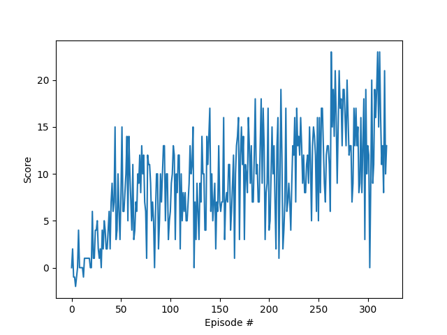
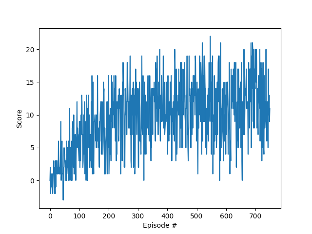
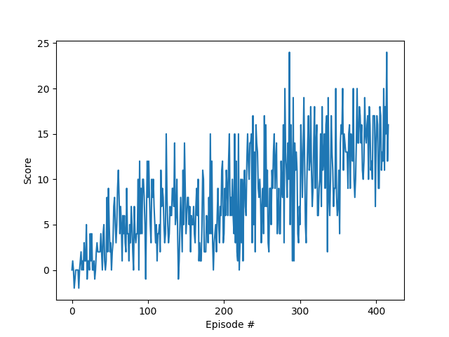
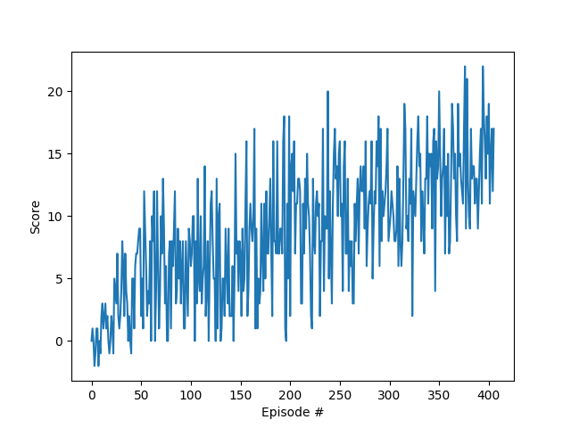
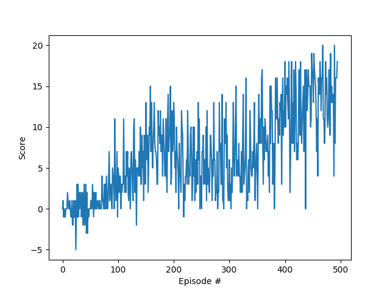
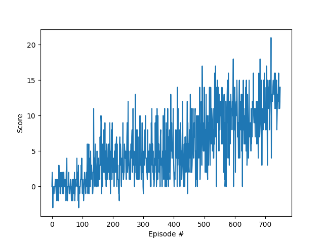

# Results report

## Selected hyperparameters

|Name|Value|
|---|---:|
|Episodes|750|
|Epsilon start|1.0|
|Epsilon decay|0.95|
|Epsilon end|0.01|
|Learning rate|0.0005|
|Gamma|0.95|
|Tau|0.001|
|Alpha|0.5|
|Beta|0.5|
|Buffer size|100000|
|Batch size|64|
|Target|13.0|

## [Deep Q Network](https://arxiv.org/abs/1312.5602)

Deep Q network:
- ReLU linear layer (in: number of states, out: 64)
- ReLU linear layer (in: 64, out: 64)
- Linear layer (in: 64, out: number of actions)

Rewards per episode with sampled replay buffer:

Rewards per episode with prioritized replay buffer:

## [Dueling Deep Q Network](https://arxiv.org/abs/1511.06581)

Dueling Deep Q network:
- ReLU linear layer (in: number of states, out: 64)
- ReLU linear layer (in: 64, out: 64)
- ReLU linear layer (in: 64, out: 32)
- Adv layer: ReLU linear layer (in: 32, out: 32), Value layer: ReLU linear layer (in: 32, out: 32)
- Adv layer: Linear layer (in: 32, out: number of actions), Value layer: Linear layer (in: 32, out: 1)
- Combined adv + value output - adv mean

Rewards per episode with sampled replay buffer:

Rewards per episode with prioritized replay buffer:

## [Dueling Deep Q Network with Noisy Net](https://arxiv.org/abs/1706.10295)

Dueling Deep Q network with Noisy Net:
- ReLU linear layer (in: number of states, out: 64)
- ReLU linear layer (in: 64, out: 64)
- ReLU linear layer (in: 64, out: 32)
- Adv layer: ReLU noisy linear layer (in: 32, out: 32), Value layer: ReLU noisy linear layer (in: 32, out: 32)
- Adv layer: Noisy linear layer (in: 32, out: number of actions), Value layer: Noisy linear layer (in: 32, out: 1)
- Combined adv + value output - adv mean

Noisy linear layer is similar to standard linear layer (Wx + b) but W and b matrices contains random noise 
with normal distribution sampled on each step. 

Rewards per episode with sampled replay buffer:

Rewards per episode with prioritized replay buffer:

## Comparison table

|Algorithm|Episodes until solved|
|---|---|
|Deep Q network with sampled replay buffer|220|
|Dueling Deep Q Network with prioritized replay buffer|306|
|Dueling Deep Q Network with sampled replay buffer|317|
|Dueling Deep Q Network with Noisy Net with sampled replay buffer|395|
|Deep Q network with prioritized replay buffer|&gt;750|
|Dueling Deep Q Network with Noisy Net with prioritized replay buffer|&gt;750|
